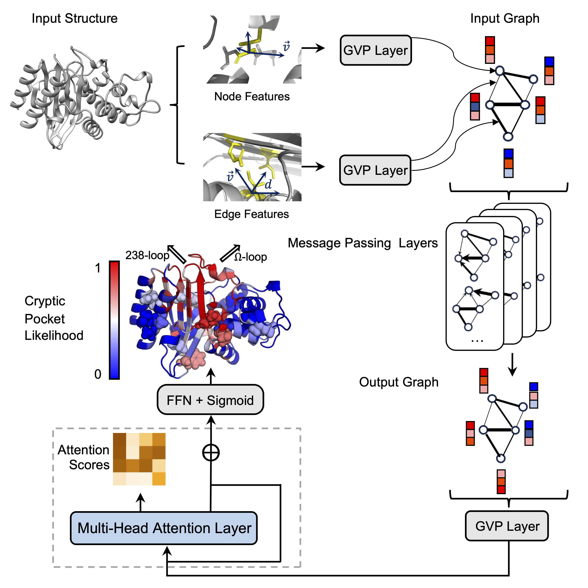

# AE-PocketMiner — Cryptic Pocket & Allosteric Coupling Prediction

An AI method for simultaneously predicting cryptic binding pockets and their 
allosteric coupling to the rest of the protein from a single input structure,
using an attention-enabled Geometric Vector Perceptron graph neural network.

<p align="center">
  
  <br/>
  <em>Figure 1. AE-PocketMiner model architecture.</em>
</p>

---

## Table of contents

- [Installation](#installation)
- [Local prediction](#local-prediction)
- [Training](#training)
- [Training data](#training-data)
- [Background](#background)
- [Citation](#citation)
- [License](#license)

---

## Installation

We provide a tested conda environment file. With
**Miniconda** or
**Mambaforge** installed,
run:

```bash
# Clone the repository
git clone https://github.com/bowman-lab/ae-pocketminer.git
cd ae-pocketminer

# Create and activate the environment (mamba is faster than conda)
mamba env create -f environment.yml   # or: conda env create -f environment.yml
conda activate pocketminer
```

If you run into issues, also check the installation notes in the
[original PocketMiner repository](https://github.com/Mickdub/gvp/tree/pocket_pred).

---

## Local prediction

For most users, we recommend trying the [PocketMiner web interface](https://pocket-miner-ui.azurewebsites.net/) first — no installation required. *(Note: this currently serves the original PocketMiner model; a version pointing to AE-PocketMiner is coming soon.)*

To run predictions locally instead, place your PDB file(s) in the `inputs/` folder and run `xtal_predict.py`
directly.

```bash
mkdir -p inputs results
cp your_protein.pdb inputs/

python src/xtal_predict.py
```

Output files are written to `results/`:
- `results/your_protein-preds.npy` — per-residue pocket probabilities
- `results/your_protein-attention_weights.npy` — attention weight matrix

To write a PDB with B-factors set to pocket probability (for PyMOL
visualisation):

```bash
python src/write_bfactor_pdb.py \
    --input  inputs/your_protein.pdb \
    --preds  results/your_protein-preds.npy \
    --output results/your_protein_scored.pdb
```

---

## Training

AE-PocketMiner was retrained in two phases, mirroring the approach used in
the original PocketMiner paper:

**Phase 1 — LIGSITE labels**

```bash
python src/train_xtal_predictor.py
```

This trains the base model using LIGSITE-derived labels from sampled
structures. Training data arrays (X and Y) are loaded from `data/task2/` as
numpy `.npy` files, following the same format as the original repo.

**Phase 2 — fpocket refinement**

```bash
python src/train_fpocket_drug_score_labels.py
```

This fine-tunes the Phase 1 checkpoint using fpocket druggability score
labels, which incorporate both pocket geometry and chemical environment.
See the PocketMiner paper for further details.

Model weights are saved to `models/`.

---

## Training data

Training data are stored as numpy arrays under `data/`, using the same
conventions as the original PocketMiner repository:

```
data/
  task2/
    X-train-*.npy        # structure/trajectory references for LIGSITE training
    y-train-*.npy        # LIGSITE pocket labels
    X-train-fpocket-*.npy   # structure references for fpocket training
    y-train-fpocket-*.npy   # fpocket druggability score labels
  pm-dataset/
    *.csv / *.txt        # PocketMiner benchmark dataset labels and PDB IDs
```

---

## Background

AE-PocketMiner is a new model developed in the Bowman Lab that predicts both
cryptic binding pockets and allosteric coupling from a single protein
structure. It uses the GVP-GNN from PocketMiner as a protein embedding
backbone — chosen for its proven performance in pocket prediction — and adds
an attention mechanism to capture long-range residue–residue dependencies.
For full details on the architecture, training data, and benchmarking, see our
paper: https://doi.org/10.64898/2026.05.21.726899

The GVP source files in `src/` are adapted from the original PocketMiner
codebase with modifications to incorporate the attention layers. For the
original model and GVP-GNN methodology, see:

**Original PocketMiner repository:**
👉 https://github.com/Mickdub/gvp/tree/pocket_pred

> Meller, A., Ward, M., Borowsky, J. *et al.* Predicting locations of cryptic 
> pockets from single protein structures using the PocketMiner graph neural 
> network. *Nature Communications*, 14, 1177 (2023).
> https://doi.org/10.1038/s41467-023-36699-3

---

## Citation

If you use AE-PocketMiner in your research, please cite:
https://doi.org/10.64898/2026.05.21.726899

---

## License

Released under the **MIT License** — see [LICENSE](LICENSE).
